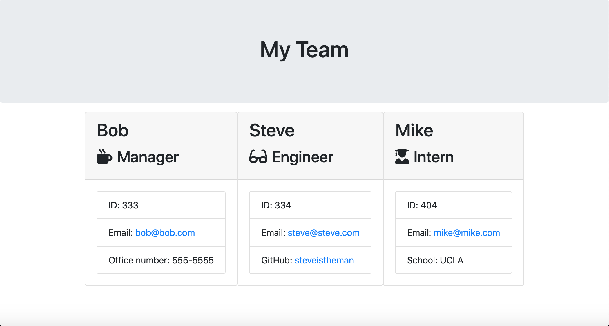

# Employee-Summary

## This is a command-line app that dynamically creates a html page to list all members of a software engineering team.

## Table of Contents

- [Installation](#installation)
- [Usage](#usage)
- [License](#license)
- [Tests](#tests)
- [Contributors](#contributors)
- [Details](#details)

## Installation

Packages required to run this program are: inquirer, jest

## Usage

Examples of how to use this program: This app can be used to create a detailed list of all members of a development team.

## License

None

## Tests

            To test, run the following command: node app.js

## Contributors

Cody Walter

## Contact

View the project in GitHub at: https://github.com/codywalter/Employee-Summary

If you have any questions, contact the author directly at: cody.walter@providencecc.edu.
